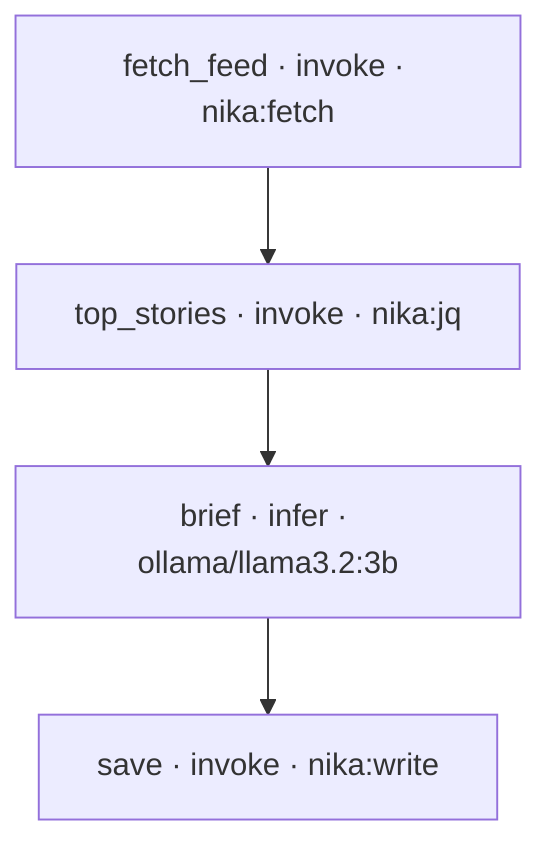

<h1 align="center">nika-starter</h1>

<p align="center"><strong>Repeatable AI jobs as files.</strong><br>
A working setup in about a minute: one proven workflow, editor wiring, agent
instructions, and CI that re-checks every workflow on every push.</p>

<p align="center">
  
</p>

<p align="center"><em>check catches it · the fix is named · the run is live · the trace is the receipt</em></p>

## Use it

1. Click **Use this template** (top right).
2. Install the engine (single binary):

```bash
brew install supernovae-st/tap/nika
```

3. Prove the setup, offline, zero keys:

```bash
nika check daily-brief.nika.yaml
nika run  daily-brief.nika.yaml --model mock/echo
```

4. Real local run (got [Ollama](https://ollama.com)?):

```bash
nika run daily-brief.nika.yaml
```

You get `brief.md`: the top Hacker News stories, briefed by a local model, with
a hash-chained trace in `.nika/traces/`. Verify it:

```bash
nika trace verify .nika/traces/*.ndjson
```

## The workflow, drawn by nika itself

This diagram is generated by `nika graph`, not drawn by hand. Run it on any
workflow and paste the output; it renders on GitHub as-is.



Four tasks, one DAG. Change the feed, the story count or the model: it is all in
the file's `vars:`.

## What is inside

| File | What it does |
|---|---|
| `daily-brief.nika.yaml` | the proven starter workflow: fetch a feed, reshape, brief with a local model, save |
| `AGENTS.md` | teaches YOUR coding agent (Claude Code, Cursor, Codex...) how to author and check workflows here |
| `.agents/skills/` | the authoring skill, picked up by agents that read skills |
| `.vscode/` | schema wiring: validation, completion and hover for `*.nika.yaml` |
| `.github/workflows/nika.yml` | CI re-checks every workflow on every push, statically, zero secrets |

Everything except the workflow and this README is written by `nika init` from the
released binary, so it stays current with the engine.

## Make it yours

```bash
nika new                      # guided authoring on the terminal
nika examples                 # 25+ embedded, runnable examples
nika explain my.nika.yaml     # what a file does, before you run it
nika graph my.nika.yaml       # the DAG, from your terminal
```

<p align="center">
  <sub>⭐ If this saved you time, a star helps other people find it.</sub>
</p>

<p align="center">
  <sub>Want AI-workflow receipts in your CI too? See <a href="https://github.com/supernovae-st/nika-actions-starter">nika-actions-starter</a>.<br>
  Docs: <a href="https://docs.nika.sh">docs.nika.sh</a> · Engine (AGPL-3.0): <a href="https://github.com/supernovae-st/nika">nika</a></sub>
</p>
